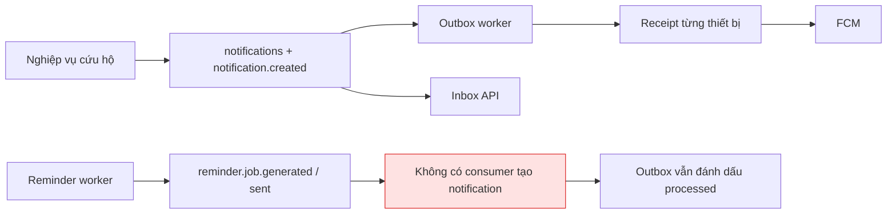
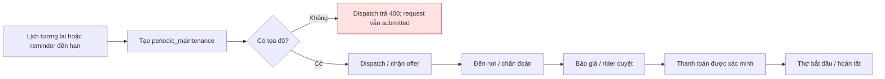

# Kiểm tra luồng thông báo và bảo dưỡng xe

Ngày kiểm tra: 01/10/2026. Phạm vi: working tree hiện tại, bao gồm các thay đổi cứu hộ/thanh toán chưa commit có sẵn. Chỉ bổ sung báo cáo; không sửa mã ứng dụng.

**Kết luận:** backend đã có các thành phần cho thông báo và bảo dưỡng, nhưng hai luồng chưa chạy xuyên suốt từ mobile đến người dùng. Lỗi lớn nhất là nhắc bảo dưỡng bị đánh dấu `sent` mà không tạo notification, và API chấp nhận yêu cầu bảo dưỡng không thể chuyển sang tìm thợ.

| Phần | Hiện trạng |
| --- | --- |
| Notification inbox | Có API đọc danh sách, số chưa đọc, đánh dấu đã đọc; kiểm tra chủ sở hữu và phân trang |
| Push backend | Có FCM HTTP v1, token mã hóa, receipt cho từng thiết bị, retry và dead letter; còn lỗi xử lý mã FCM và cạnh tranh khi hết lease |
| Notification cho nghiệp vụ | Các nơi gọi tạo notification hiện gắn với cứu hộ; bảo dưỡng thông thường và reminder chưa nối vào |
| Reminder backend | Có lịch theo ngày/giờ, lặp theo ngày, hoãn, tắt, occurrence chống trùng; chưa nối sang notification |
| Yêu cầu bảo dưỡng backend | Có tạo theo lịch hoặc từ occurrence đến hạn; dùng luồng assignment, quote và payment chung |
| Mobile | Đặt/hủy lịch, lịch sử, công việc thợ và cài đặt thông báo đều đang dùng dữ liệu mock hoặc state cục bộ |
| Web | Trang khởi tạo Next.js, chưa có hai luồng này |

## Luồng thông báo hiện tại

1. Client đăng ký thiết bị bằng JWT qua `POST /api/v1/auth/devices`, kèm `push_provider: "fcm"` và token. Backend hash device key, mã hóa token, hỗ trợ đổi/thu hồi token.
2. Nghiệp vụ gọi `persistNotification`: ghi `notifications`, sự kiện `notification.created` và audit trong cùng transaction; `dedupe_key` chống tạo trùng.
3. Một tiến trình bên ngoài gọi `POST /api/v1/internal/workers/outbox/run` bằng worker secret. Worker claim tối đa 25 sự kiện với lease 60 giây.
4. Consumer `notification.created` gọi `NotificationDeliveryService`, lấy credential đang bật, tạo receipt theo notification/credential/version và gửi FCM.
5. Thành công hoặc lỗi vĩnh viễn được lưu theo thiết bị; lỗi tạm thời làm outbox retry rồi dead letter sau số lần giới hạn. Không có thiết bị là kết quả terminal `failed/NO_ACTIVE_DEVICE`, không gọi provider.
6. Inbox vẫn đọc được notification dù push chưa gửi hoặc gửi thất bại. `read_at` độc lập với trạng thái gửi.



Điểm vào chính: [auth.service.ts](D:/fpt/subject/EXE101/CareOnRoad-mobile-break/apps/api/src/features/auth/auth.service.ts:128), [notification.service.ts](D:/fpt/subject/EXE101/CareOnRoad-mobile-break/apps/api/src/features/notifications/notification.service.ts:80), [outbox.route-handlers.ts](D:/fpt/subject/EXE101/CareOnRoad-mobile-break/apps/api/src/features/outbox/outbox.route-handlers.ts:35), [notification-inbox.service.ts](D:/fpt/subject/EXE101/CareOnRoad-mobile-break/apps/api/src/features/notifications/notification-inbox.service.ts:32).

## Luồng bảo dưỡng hiện tại

**Trên mobile:** chọn xe/dịch vụ/ngày/giờ → chờ `setTimeout(600)` → thêm appointment vào React state với trạng thái `confirmed` → hiển thị màn xác nhận. Hủy lịch chỉ chuyển dữ liệu giữa hai mảng state. Không có request API, không tạo reminder thật, không nối sang công việc thợ. Khởi động lại ứng dụng sẽ trở về dữ liệu mock. Màn xác nhận vẫn hứa gửi nhắc lịch trước buổi hẹn.

**API đặt lịch trực tiếp:** `POST /api/v1/service-requests`, `service_type: "periodic_maintenance"`, lịch tương lai và idempotency key → request `submitted`. API không tự tạo reminder hay tự tìm thợ.

**API từ nhắc bảo dưỡng:** tạo reminder gắn với xe → gọi reminder worker khi đến hạn → tạo occurrence → rider gửi `reminder_id` và `reminder_context_id` khi tạo service request. Backend kiểm tra chủ sở hữu, xe, trạng thái và thời gian đến hạn; tạo request rồi chuyển occurrence sang `dismissed`. Nhánh này bắt buộc bỏ `scheduled_start_at`.

**Sau khi có request với tọa độ:** rider gọi dispatch → thợ nhận offer → assignment đi qua các bước đến nơi, chẩn đoán, báo giá standard → rider duyệt → `awaiting_payment` → tạo payment order → webhook/reconcile xác minh thanh toán → thợ chủ động chuyển `in_progress` → `completed` → rider đánh giá. Duyệt báo giá hoặc nhận thanh toán không tự bắt đầu công việc.



Backend nhắc theo ngày/giờ, **chưa có logic theo số km**; đây là phạm vi đã ghi trong spec, không phải lỗi. `last_completed_at` của reminder hiện được ghi khi worker xử lý lần nhắc, không chứng minh xe đã được bảo dưỡng. Các trường `lastMaintenance`, `nextMaintenance`, `mileage` trên mobile chưa có ánh xạ trực tiếp trong motorcycle API. Khi hoàn tất assignment, chưa có bước tự cập nhật ngày bảo dưỡng hoặc tính lịch tiếp theo từ ngày sửa xong.

## Lỗi đã xác nhận

### 1. P1 — Nhắc bảo dưỡng báo đã gửi nhưng không tạo thông báo

**Nguyên nhân:** reminder worker ghi occurrence `sent` và đẩy lịch lặp sang kỳ sau. Nó chỉ tạo `reminder.job.generated` / `reminder.job.sent`. Default outbox chỉ đăng ký consumer cho `notification.created` và `assignment.recovery.requested`. Sự kiện reminder không có handler được trả về như thành công và đánh dấu `processed`.

**Tái hiện:** một rule đến hạn → worker trả `{ claimed: 1, generated: 1, sent: 1, failed: 0 }`; chạy outbox → `processed: 2`; số notification = **0**, số lần gọi provider = **0**. Rule một lần còn bị tắt sau đó. Client qua API hiện cũng không có endpoint đọc occurrence để lấy `reminder_context_id`.

**Hướng sửa nhỏ:** nối sự kiện đến hạn với việc tạo notification chống trùng theo occurrence, lưu liên kết notification/occurrence, cung cấp context an toàn cho thao tác đặt bảo dưỡng. Làm rõ `queued` và `sent`; không coi việc tạo job là đã gửi push.

Nguồn: [reminder.worker.ts:66](D:/fpt/subject/EXE101/CareOnRoad-mobile-break/apps/api/src/server/workers/reminder.worker.ts:66), [outbox.route-handlers.ts:51](D:/fpt/subject/EXE101/CareOnRoad-mobile-break/apps/api/src/features/outbox/outbox.route-handlers.ts:51), [outbox-consumers.ts:25](D:/fpt/subject/EXE101/CareOnRoad-mobile-break/apps/api/src/features/outbox/outbox-consumers.ts:25).

### 2. P1 — API tạo được yêu cầu bảo dưỡng nhưng không tìm được thợ

**Nguyên nhân:** ma trận đầu vào periodic maintenance chỉ yêu cầu lịch hoặc reminder context; không bắt buộc `location`. Dispatch lại bắt buộc `request.serviceLocation`. Không có API sửa tọa độ request đã tạo, cũng chưa thấy đường tạo assignment khác ngoài nhận dispatch offer.

**Tái hiện:** tạo request từ occurrence hợp lệ, bỏ location → tạo thành công, occurrence thành `dismissed` → dispatch trả `400 INVALID_INPUT`; request vẫn `submitted`. Nhánh đặt lịch trực tiếp cũng có cùng khoảng trống dữ liệu.

**Hướng sửa nhỏ:** thống nhất địa điểm phục vụ của bảo dưỡng với cơ chế phân công. Nếu dùng dispatch hiện tại, lấy và kiểm tra tọa độ trước khi nhận request; nếu bảo dưỡng tại gara, cần đường phân công phù hợp thay vì để request thiếu địa điểm.

Nguồn: [service-request.service.ts:400](D:/fpt/subject/EXE101/CareOnRoad-mobile-break/apps/api/src/features/service-requests/service-request.service.ts:400), [dispatch.service.ts:80](D:/fpt/subject/EXE101/CareOnRoad-mobile-break/apps/api/src/features/dispatch/dispatch.service.ts:80).

### 3. P1 — Push có thể gửi trùng khi lease hết trong lúc xử lý

**Nguyên nhân:** toàn bộ batch nhận lease 60 giây rồi xử lý tuần tự, không gia hạn lease. Receipt chỉ tránh gửi lại sau khi đã có kết quả terminal; receipt đang `pending` không được claim riêng trước khi gọi provider. Batch nhiều sự kiện/thiết bị hoặc timeout cao có thể vượt thời gian lease.

**Tái hiện bằng đồng hồ giả:** worker A đang gửi; worker B claim lại ở giây 61 khi receipt vẫn pending → cùng một notification/credential có **2 lần gửi**. Worker B xử lý xong; worker A tiếp tục gặp `OUTBOX_LEASE_LOST`. Nhánh catch lại cố ghi thất bại bằng lease đã mất nên lỗi thoát khỏi batch.

**Hướng sửa:** kiểm soát thời hạn và quyền xử lý trước mỗi lần gửi, gia hạn/claim phù hợp, bảo vệ cạnh tranh ở receipt; xử lý lease mất mà không làm dừng các sự kiện còn lại. Không khẳng định exactly-once chỉ từ unique constraint của receipt.

Nguồn: [outbox.worker.ts:43](D:/fpt/subject/EXE101/CareOnRoad-mobile-break/apps/api/src/server/workers/outbox.worker.ts:43), [notification-delivery.service.ts:73](D:/fpt/subject/EXE101/CareOnRoad-mobile-break/apps/api/src/features/notifications/notification-delivery.service.ts:73), [notification-delivery.repository.ts:43](D:/fpt/subject/EXE101/CareOnRoad-mobile-break/apps/api/src/server/repositories/postgres/notification-delivery.repository.ts:43).

### 4. P2 — Ngày hoãn cũ ghi đè lịch vừa cập nhật

`updateRule` sửa `next_due_at` nhưng giữ `snoozed_until`; worker chọn `coalesce(snoozed_until, next_due_at)`. Tái hiện: rule hoãn đến 10/10, đổi lịch sang 20/10 → vẫn tạo occurrence ngày **10/10**. Ngoài ra API snooze chỉ kiểm tra lớn hơn hiện tại, nên có thể chọn ngày trước `next_due_at` và làm nhắc sớm.

Hướng sửa nhỏ: xóa hoặc đối chiếu ngày hoãn khi thay lịch; xác định rõ snooze là trì hoãn và kiểm tra mốc phù hợp.

Nguồn: [reminder.repository.ts:87](D:/fpt/subject/EXE101/CareOnRoad-mobile-break/apps/api/src/server/repositories/postgres/reminder.repository.ts:87), [reminder.service.ts:146](D:/fpt/subject/EXE101/CareOnRoad-mobile-break/apps/api/src/features/reminders/reminder.service.ts:146).

### 5. P2 — Bộ lọc audit xóa dữ liệu điều hướng của notification

`persistNotification` dùng `sanitizeAuditMetadata` cho dữ liệu nghiệp vụ; inbox lại lọc lần nữa. Allowlist không có `candidate_id`, `quote_id`, `reminder_id`, `reminder_context_id`, `motorcycle_id`, `payment_order_id`, `version`.

Tái hiện: gửi data chứa request ID và các reference nói trên → notification chỉ giữ **`request_id`**. Push rescue mất candidate/quote cụ thể; một notification reminder chỉ chứa reminder context sẽ bị lọc mất context. Vẫn có thể điều hướng rescue theo request ID, nhưng không giữ đầy đủ đích nghiệp vụ đã truyền vào.

Hướng sửa nhỏ: cho phép các reference an toàn cần cho notification bằng schema/allowlist riêng; giữ bộ lọc chặt cho audit và không đưa token hoặc dữ liệu thanh toán nhạy cảm vào payload.

Nguồn: [notification.service.ts:89](D:/fpt/subject/EXE101/CareOnRoad-mobile-break/apps/api/src/features/notifications/notification.service.ts:89), [audit-sanitizer.ts:3](D:/fpt/subject/EXE101/CareOnRoad-mobile-break/apps/api/src/features/audit/audit-sanitizer.ts:3), [notification-inbox.service.ts:131](D:/fpt/subject/EXE101/CareOnRoad-mobile-break/apps/api/src/features/notifications/notification-inbox.service.ts:131).

### 6. P2 — Sai thứ tự đọc mã lỗi FCM, token hết hiệu lực không bị vô hiệu hóa

`extractProviderCode` trả `error.status` trước khi đọc `details[].errorCode`. Tái hiện với HTTP 404, status `NOT_FOUND`, FCM detail `UNREGISTERED` → kết quả thực tế `permanent_failure/FCM_REJECTED`, thay vì `invalid_credential`. Nhánh `disableIfCurrent` vì thế không chạy; credential hỏng tiếp tục được dùng cho notification mới. `SENDER_ID_MISMATCH` trong details cũng có vấn đề tương tự.

Hướng sửa nhỏ: ưu tiên detail có đúng type FCM rồi mới fallback sang status; thêm kiểm tra response có cả hai trường. [Firebase Admin SDK chính thức cũng đọc FCM detail trước status](https://github.com/firebase/firebase-admin-node/blob/master/src/messaging/messaging-errors-internal.ts); [tài liệu FCM](https://firebase.google.com/docs/cloud-messaging/error-codes) mô tả mã lỗi chi tiết và token không còn hợp lệ.

Nguồn: [fcm-notification-provider.ts:187](D:/fpt/subject/EXE101/CareOnRoad-mobile-break/apps/api/src/features/notifications/fcm-notification-provider.ts:187).

### 7. P2 — Xe đã archive vẫn tiếp tục chạy reminder

Archive motorcycle không tắt rule; query claim rule chỉ kiểm tra enabled, đến hạn và lease, không kiểm tra xe archive. Tái hiện: archive xe có rule lặp đang bật → reminder worker vẫn tạo occurrence `sent`, rule tiếp tục enabled. Khi rider tạo service request từ nhắc đó, kiểm tra xe đã archive sẽ từ chối.

Hướng sửa nhỏ: ngừng rule trong transaction archive hoặc lọc xe không còn hoạt động trước khi claim.

Nguồn: [motorcycle.service.ts:140](D:/fpt/subject/EXE101/CareOnRoad-mobile-break/apps/api/src/features/motorcycles/motorcycle.service.ts:140), [reminder.repository.ts:127](D:/fpt/subject/EXE101/CareOnRoad-mobile-break/apps/api/src/server/repositories/postgres/reminder.repository.ts:127).

## Khoảng trống tích hợp và vận hành

- **Mobile notification chưa hoạt động:** nút chuông không có `onPress`, chấm đỏ luôn hiện; toggle chỉ đổi state, không lưu lựa chọn hoặc gọi backend. Chưa có mã lấy/đăng ký push token, xử lý notification hay màn inbox. Đây là phần tích hợp chưa làm; spec backend hiện loại frontend/preferences khỏi phạm vi. Nguồn: [app-header.tsx:57](D:/fpt/subject/EXE101/CareOnRoad-mobile-break/apps/mobile/src/components/ui/app-header.tsx:57), [profile.tsx:30](D:/fpt/subject/EXE101/CareOnRoad-mobile-break/apps/mobile/app/rider/(tabs)/profile.tsx:30).
- **Mobile bảo dưỡng là prototype:** đặt/hủy/lịch sử chưa dùng API; công việc thợ cũng là mock độc lập, không nhận appointment của rider. Nút Confirm trên booking card chưa có handler; trường ngày chỉ kiểm tra không rỗng, có thể nhận ngày sai hoặc quá khứ. Thông báo nhắc trước buổi hẹn ở màn xác nhận chưa có thực thi. Nguồn: [app-context.tsx:45](D:/fpt/subject/EXE101/CareOnRoad-mobile-break/apps/mobile/src/contexts/app-context.tsx:45), [booking.tsx:27](D:/fpt/subject/EXE101/CareOnRoad-mobile-break/apps/mobile/app/rider/schedule/booking.tsx:27), [booking-card.tsx:64](D:/fpt/subject/EXE101/CareOnRoad-mobile-break/apps/mobile/src/components/booking-card.tsx:64), [mechanic-app-context.tsx:39](D:/fpt/subject/EXE101/CareOnRoad-mobile-break/apps/mobile/src/contexts/mechanic-app-context.tsx:39).
- **Bảo dưỡng standard chưa sinh notification nghiệp vụ:** gọi `persistNotification` trong dispatch, quote, payment và completion đều bị giới hạn vào rescue. Offer, báo giá cần duyệt, thanh toán thành công và hoàn tất bảo dưỡng chỉ có domain outbox; không có consumer tương ứng tạo notification. Nguồn: [dispatch.service.ts:572](D:/fpt/subject/EXE101/CareOnRoad-mobile-break/apps/api/src/features/dispatch/dispatch.service.ts:572), [quote.service.ts:502](D:/fpt/subject/EXE101/CareOnRoad-mobile-break/apps/api/src/features/quotes/quote.service.ts:502), [payment.service.ts:678](D:/fpt/subject/EXE101/CareOnRoad-mobile-break/apps/api/src/features/payments/payment.service.ts:678), [assignment.service.ts:194](D:/fpt/subject/EXE101/CareOnRoad-mobile-break/apps/api/src/features/assignments/assignment.service.ts:194).
- **Chưa thấy lịch gọi reminder worker trong repo:** CLI `workers:payments:watch` gọi outbox, dispatch và payment reconcile, bỏ `reminders/run`; `vercel.json` không khai báo cron. Cần một scheduler bên ngoài hoặc bổ sung route này vào runner đang vận hành. Chưa kiểm tra scheduler đã cấu hình bên ngoài repo nên không kết luận môi trường hosted không có lịch. Nguồn: [run-payment-workers.mjs:29](D:/fpt/subject/EXE101/CareOnRoad-mobile-break/apps/api/scripts/run-payment-workers.mjs:29).
- **Lịch bảo dưỡng chưa được dùng để kích hoạt công việc:** `scheduled_start_at` được lưu/hiển thị; dispatch worker chỉ xử lý round đã hết hạn. Request mới không tự được dispatch khi đến lịch, và `startDispatch` không kiểm tra mốc lịch trước khi tạo offer. Cần thống nhất việc chọn thợ trước buổi hẹn và việc thực hiện đúng giờ; hiện chưa có cơ chế đặt chỗ/giữ slot.
- **Khởi tạo outbox phụ thuộc khóa push:** default handler gọi `createPushTokenCipher()` ngay khi tạo route handler; thiếu/sai `PUSH_TOKEN_ENCRYPTION_KEY` sẽ throw trước vòng xử lý lỗi của handler, kể cả batch chỉ cần recovery. Health check nhóm notifications chỉ kiểm tra ba biến FCM, chưa kiểm tra khóa này. Đây là điều kiện cấu hình phải kiểm tra khi chạy thực tế. Nguồn: [outbox.route-handlers.ts:41](D:/fpt/subject/EXE101/CareOnRoad-mobile-break/apps/api/src/features/outbox/outbox.route-handlers.ts:41), [health-config.ts:15](D:/fpt/subject/EXE101/CareOnRoad-mobile-break/apps/api/src/features/health/health-config.ts:15).
- **Retry chưa dùng `Retry-After`:** FCM provider parse header, nhưng delivery service bỏ thông tin đó và outbox dùng backoff mặc định 1/2/4/8 giây. Cần truyền mốc retry qua để tôn trọng thời gian provider yêu cầu, nhất là khi throttled. [Tài liệu FCM](https://firebase.google.com/docs/cloud-messaging/error-codes) yêu cầu tôn trọng `Retry-After` với lỗi tạm thời và backoff phù hợp với quota.

## Kiểm chứng và giới hạn

Hai lệnh kiểm tra cục bộ đã đạt **42 file / 136 test**:

```powershell
pnpm.cmd --filter @careonroad/api test src/features/notifications src/features/reminders src/features/outbox src/features/service-requests src/features/dispatch src/features/assignments src/features/quotes
pnpm.cmd --filter @careonroad/api test src/features/payments src/features/auth src/server/repositories/testing/__tests__/notification-inbox.repository.contract.test.ts src/server/db/__tests__/notification-provider-delivery-migration.test.ts src/server/db/__tests__/notification-inbox-migration.test.ts
```

Bổ sung **7 kiểm tra tái hiện trong bộ nhớ**, dùng service thật và provider giả: mất notification reminder, thiếu tọa độ khi dispatch, snooze cũ, data bị lọc, mã FCM bị bỏ qua, gửi trùng khi lease hết, reminder của xe archive. Các kiểm tra xác nhận hành vi lỗi hiện tại, không phải bằng chứng đã sửa. Không lưu script tạm vào mã ứng dụng.

Test đang có chủ yếu kiểm tra từng thành phần; reminder worker test chỉ yêu cầu occurrence `sent` và hai outbox event, chưa yêu cầu notification được tạo. FCM test giả lập mã đặc thù ở `error.status`, chưa có trường hợp status tổng quát kèm FCM detail.

Chưa chạy PostgreSQL integration, chưa xác minh migration trên hosted, chưa gọi provider hoặc gửi push thật, chưa thử UI trên thiết bị. Không chạy build vì đây là rà soát, không đổi route/frontend/TypeScript. Không đọc hoặc đưa giá trị bí mật vào báo cáo.

Ưu tiên nối reminder → notification, thống nhất địa điểm/phân công bảo dưỡng và xử lý lease trước; sau đó sửa snooze, data và FCM, rồi tích hợp mobile vào API. Thêm kiểm tra xuyên suốt một reminder đến hạn → inbox → tạo yêu cầu → phân công → báo giá → thanh toán → hoàn tất để tránh tình trạng test thành phần đạt nhưng luồng thực tế bị đứt.
