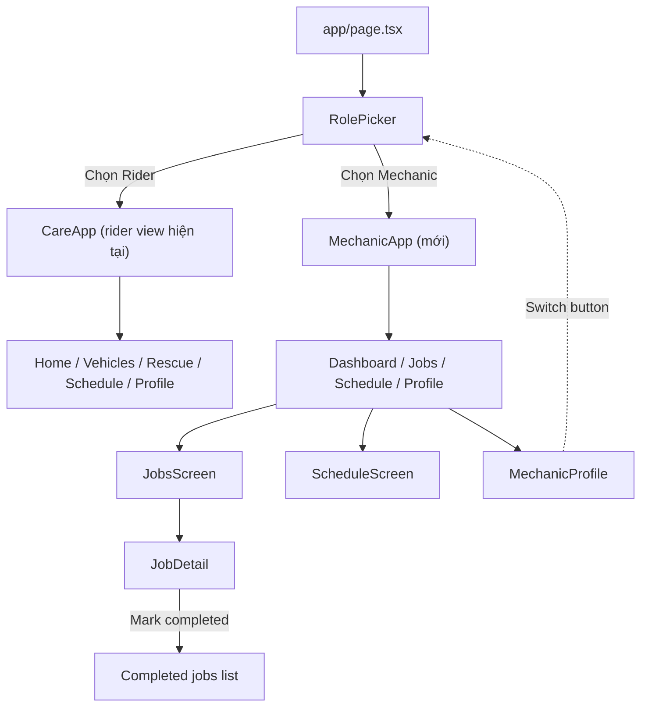

# Plan: Mechanic View cho CareOnRoad

## Mục tiêu

Thêm bộ trang cho **thợ sửa xe / garage** song song với rider view hiện tại. Tổ chức sao cho dễ demo, dễ refactor thành app riêng sau này (chỉ cần tách folder `components/mechanic/` + `lib/mechanic-*` và đổi router ở `app/page.tsx`).

## Quyết định kiến trúc

| Mục | Quyết định |
|---|---|
| Đối tượng | Thợ thuộc garage (có quản lý đội ngũ + lịch làm việc) |
| Entry point | Màn hình chọn role ở `app/page.tsx` |
| Scope | 5 trang core + 1 màn hình role-picker |
| Tách biệt rider/mechanic | Folder riêng `components/mechanic/`, không xài `components/care/` chung |
| State management | Một `MechanicAppContext` riêng, mock data riêng — refactor sang store thật sau |
| Theme/ui | Tái sử dụng `components/care/ui.tsx` (Card, Badge, ActionButton, Field, TextInput, SectionHeader) — không duplicate primitive |

## Cấu trúc folder mới

```
components/mechanic/
  mechanic-app.tsx              # Shell tương tự CareApp nhưng context + nav riêng
  mechanic-app-context.tsx      # Provider riêng: jobs, customers, schedule, earnings, garageInfo
  mechanic-bottom-nav.tsx       # 4 tab: Dashboard / Jobs / Schedule / Profile
  screens/
    mechanic-dashboard.tsx      # Trang tổng quan hôm nay
    mechanic-jobs-screen.tsx    # Danh sách công việc + filter
    mechanic-job-detail.tsx     # Chi tiết 1 job + update status
    mechanic-schedule.tsx       # Lịch làm việc tuần + slots
    mechanic-profile.tsx        # Hồ sơ thợ + thống kê thu nhập
  cards/
    job-card.tsx                # Card hiển thị 1 job
    customer-card.tsx           # Card hiển thị 1 khách
    earnings-card.tsx           # Card thu nhập
  forms/
    job-update-form.tsx         # Form cập nhật trạng thái + ghi chú sửa chữa

components/role-picker.tsx      # Landing chọn role (rider / mechanic)

lib/
  mechanic-types.ts             # Types riêng: MechanicJob, MechanicCustomer, ScheduleSlot, GarageInfo
  mechanic-mock-data.ts         # Mock data riêng
```

## 5 trang core

### 1. Mechanic Dashboard
- Header chào + avatar thợ + tên garage
- Card "Hôm nay": số job đang chờ, đang làm, hoàn thành
- Card "Thu nhập tuần này" (VND) với delta so với tuần trước
- Danh sách job sắp tới hôm nay (top 3) → dẫn vào Jobs screen
- Quick action: "Bắt đầu job tiếp theo"

### 2. Jobs
- Sub-tabs filter: All / Pending / In progress / Completed
- Mỗi job là `JobCard`:
  - Tên khách + SĐT (bấm gọi)
  - Biển số xe + loại dịch vụ
  - Trạng thái (Badge màu theo status)
  - Thời gian hẹn + giá
  - Nút "View" → mở job-detail
- Empty state khi không có job

### 3. Job Detail
- Thông tin xe + khách + triệu chứng báo ban đầu
- Timeline trạng thái: Assigned → In progress → Awaiting parts → Completed
- Nút cập nhật trạng thái + textarea ghi chú sửa chữa + input phụ tùng đã thay
- Giá cuối + ảnh trước/sau (mock = placeholder)
- Nút "Mark as completed" → đẩy vào history

### 4. Schedule
- Hiển thị lịch tuần (7 cột)
- Mỗi ngày liệt kê slot giờ + job đã book
- Click vào slot để xem chi tiết job
- Hiển thị trạng thái: Working / Off / Available

### 5. Profile
- Avatar + tên + chuyên môn + số năm kinh nghiệm + rating
- Thống kê: Tổng job đã làm, Rating trung bình, Thu nhập tháng này
- Certifications list
- Settings: thông báo, ngôn ngữ, dark mode
- Nút "Switch to Rider view" (để demo tiện)

## Entry point — Role picker

Sửa `app/page.tsx`:

```tsx
import { RolePicker } from "@/components/role-picker"

export default function Page() {
  return <RolePicker />
}
```

Tạo mới `components/role-picker.tsx` — landing page có 2 card lớn:
- **I'm a Rider** → render `CareApp` (giữ nguyên)
- **I'm a Mechanic** → render `MechanicApp`

Lưu state role vào `localStorage` để refresh không bị reset, có nút "Switch" ở góc để đổi qua lại khi demo.

## State / Data layer

`mechanic-app-context.tsx` cung cấp:

```ts
interface MechanicState {
  mechanic: MechanicProfile
  garage: GarageInfo
  jobs: MechanicJob[]
  todayJobs: MechanicJob[]      // derived
  weekEarnings: number          // derived
  updateJobStatus: (id: string, status: JobStatus, notes?: string) => void
  completeJob: (id: string, payload: { price: number; repairs: string; parts: string[] }) => void
}
```

Mock data trong `mechanic-mock-data.ts`:
- 1 `MechanicProfile` (tên + ảnh + chuyên môn + rating)
- 1 `GarageInfo` (tên garage, địa chỉ)
- 8–10 `MechanicJob` ở các trạng thái khác nhau (pending / in_progress / awaiting_parts / completed)
- Lịch tuần (7 ngày × 8 slots)

## Tái sử dụng từ rider view

| Component | Từ | Dùng cho |
|---|---|---|
| `Card`, `Badge`, `ActionButton`, `Field`, `TextInput`, `SectionHeader` | `components/care/ui.tsx` | Mọi primitive UI |
| `cn` utility | `lib/utils.ts` | className merging |
| `formatVND`, `formatDate` | `lib/mock-data.ts` | Hiển thị tiền/ngày |
| `AppHeader` | `components/care/app-header.tsx` | Header các trang |

## Files cần tạo / sửa

**Mới (15 files):**
- `components/role-picker.tsx`
- `components/mechanic/mechanic-app.tsx`
- `components/mechanic/mechanic-app-context.tsx`
- `components/mechanic/mechanic-bottom-nav.tsx`
- `components/mechanic/screens/mechanic-dashboard.tsx`
- `components/mechanic/screens/mechanic-jobs-screen.tsx`
- `components/mechanic/screens/mechanic-job-detail.tsx`
- `components/mechanic/screens/mechanic-schedule.tsx`
- `components/mechanic/screens/mechanic-profile.tsx`
- `components/mechanic/cards/job-card.tsx`
- `components/mechanic/cards/customer-card.tsx`
- `components/mechanic/cards/earnings-card.tsx`
- `components/mechanic/forms/job-update-form.tsx`
- `lib/mechanic-types.ts`
- `lib/mechanic-mock-data.ts`

**Sửa (1 file):**
- `app/page.tsx` — đổi từ render `<CareApp />` sang `<RolePicker />`

## Sơ đồ luồng



## Triển khai theo thứ tự

1. **Tạo types & mock data trước** (`lib/mechanic-types.ts`, `lib/mechanic-mock-data.ts`) — nền tảng cho mọi trang.
2. **Tạo context** (`mechanic-app-context.tsx`) — provider + hooks + actions.
3. **Tạo cards** (`job-card.tsx`, `customer-card.tsx`, `earnings-card.tsx`) — dùng lại nhiều nơi.
4. **Tạo form** (`job-update-form.tsx`) — dùng trong job-detail.
5. **Tạo 5 màn hình** theo thứ tự: dashboard → jobs → job-detail → schedule → profile.
6. **Tạo shell** (`mechanic-app.tsx`, `mechanic-bottom-nav.tsx`) — gắn context + nav + screen switching.
7. **Tạo role-picker** ở `components/role-picker.tsx`.
8. **Sửa `app/page.tsx`** để dùng role-picker.
9. **Verify**: `npm run dev` không lỗi, `ReadLints` pass, smoke-test các flow chính.

## Cách tách thành app riêng sau này

Sau demo, việc tách chỉ cần:
1. Move folder `components/mechanic/` ra `apps/mechanic-app/components/`
2. Move `lib/mechanic-types.ts` + `lib/mechanic-mock-data.ts` ra `apps/mechanic-app/lib/`
3. Tạo Next.js project mới ở `apps/mechanic-app/` với `app/page.tsx` render `<MechanicApp />`
4. Có thể giữ `components/care/ui.tsx` ở shared package hoặc duplicate (đã được thiết kế không phụ thuộc domain)

## Verification (sau khi code)

1. `npm run dev` không lỗi compile
2. Từ `RolePicker` chọn "I'm a Mechanic" → hiển thị đủ 5 trang
3. Bấm "Mark as completed" ở job detail → job chuyển sang completed
4. `ReadLints` pass
5. Refresh page → giữ nguyên role đã chọn (localStorage)

## Không làm trong task này

- Không tích hợp API thật (vẫn mock)
- Không làm auth/login
- Không responsive tablet/desktop — giữ phone-first 440px max-width như rider view
- Không đổi theme màu sắc — giữ design system hiện tại
