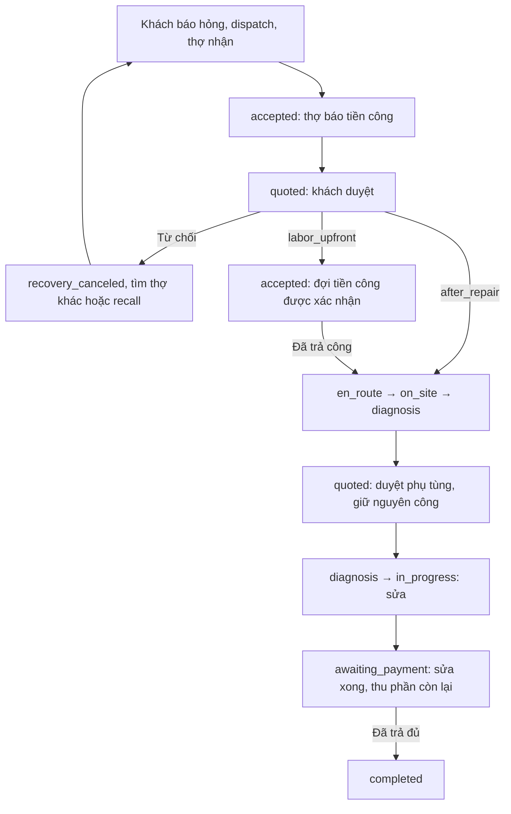

# Workflow cứu hộ và thanh toán

Áp dụng cho `service_type=emergency_rescue`. Backend/API đã hỗ trợ luồng này;
mobile và web chưa được thay đổi. Các dịch vụ khác vẫn dùng báo giá tiêu chuẩn
và thanh toán trước khi bắt đầu sửa. Phương thức thanh toán hiện có là chuyển
khoản VietQR/payOS; không có API xác nhận tiền mặt.

## Luồng nghiệp vụ

1. Khách tạo yêu cầu gồm xe, mô tả sự cố và vị trí. Khách bắt đầu tìm thợ.
   Backend lọc thợ đang hoạt động, sẵn sàng, đúng dịch vụ, có vị trí còn mới và
   không bận; ưu tiên khoảng cách gần. Thợ nhận lời mời và được gán yêu cầu.
2. Trước khi đi, thợ nhập tiền công cơ bản, phí khoảng cách, phí thời tiết và
   phí thời điểm. Tiền công cơ bản phải lớn hơn 0; các phụ phí có thể bằng 0.
   Backend cộng tổng, lưu khoảng cách tại lúc dispatch và buổi trong ngày tại
   lúc báo giá. Thợ chọn `sunny` hoặc `rain`; app không tự tính tiền theo bảng giá.
3. Khách xem từng khoản và tổng, đồng ý đồng thời chọn một trong hai cách:
   - `labor_upfront`: thanh toán tiền công qua payOS/VietQR. Chỉ khi backend xác
     nhận thành công thì thợ mới được chuyển sang đang di chuyển.
   - `after_repair`: thợ được di chuyển sau khi khách đồng ý; tiền công và phụ
     tùng được thanh toán cùng nhau sau khi sửa xong.
   Tiền công và cách thanh toán được khóa trên assignment, không đổi qua báo giá sau.
4. Nếu khách từ chối tiền công, assignment cũ chuyển `recovery_canceled`, yêu
   cầu về `submitted`, lịch sử thợ/báo giá được giữ. Outbox worker bắt đầu tìm
   các thợ khác gần nhất trong nhóm đủ điều kiện; khách cũng có thể gọi dispatch
   ngay. Không bảo đảm có thợ gần hơn nếu khu vực không có người đủ điều kiện.
   Khách có thể mời lại thợ đã từ chối bằng API recall, kể cả khi tìm kiếm đã
   chuyển `manual_escalation`. Thợ phải vẫn đủ điều kiện và nhận lời mời mới;
   backend tạo assignment và báo giá mới, không khôi phục assignment cũ.
5. Thợ đến nơi, kiểm tra và gửi báo giá `rescue_final` gồm phụ tùng cần thay.
   Backend tự đưa nguyên tiền công đã duyệt vào tổng. Khách duyệt trước khi sửa.
   Nếu không thay phụ tùng, thợ gửi `lines: []`. Nếu khách từ chối phụ tùng,
   thợ phải gửi báo giá điều chỉnh; không được bắt đầu sửa từ báo giá bị từ chối.
6. Thợ bắt đầu sửa, sửa xong rồi chuyển `awaiting_payment`. Lúc này backend mới
   cho tạo lệnh thu khoản còn lại: tổng đã duyệt trừ các khoản thanh toán đã
   xác nhận cho assignment. Không tạo lệnh 0 đồng, không thu lại tiền công đã trả.
7. Webhook payOS có chữ ký hoặc reconciliation xác nhận tiền. Thợ chuyển
   `completed` khi toàn bộ tổng đã duyệt được thanh toán. Khách có thể đánh giá.
   Trường hợp trả công trước và không thay phụ tùng có thể đóng việc ngay sau
   bước sửa xong vì khoản còn lại bằng 0.

Ví dụ: công cơ bản 100.000 + khoảng cách 20.000 + mưa 10.000 + khuya 30.000
= **160.000 đồng tiền công**. Thay bugi 50.000 → **tổng 210.000 đồng**.
Trả trước: 160.000 trước khi đi, 50.000 sau sửa. Trả sau: 210.000 sau sửa.

## API theo thứ tự

Mọi API của khách/thợ dùng `Authorization: Bearer <Supabase access token>`.
Tạo yêu cầu và tạo payment order cần `X-Idempotency-Key` từ 8 đến 200 ký tự;
dùng lại cùng key/payload để retry, dùng key mới cho một thao tác mới.
Các ID dưới đây là UUID thực nhận từ API.

| Bước | Actor | API / payload chính |
| --- | --- | --- |
| Báo sự cố | Khách | `POST /api/v1/service-requests` với `motorcycle_id`, `service_type: "emergency_rescue"`, `problem_description`, `location: {latitude, longitude}` |
| Tìm thợ | Khách | `POST /api/v1/service-requests/{requestId}/dispatch` |
| Xem và nhận lời mời | Thợ | `GET /api/v1/dispatch/offers`, `POST /api/v1/dispatch/offers/{offerId}/accept` |
| Báo tiền công | Thợ | `POST /api/v1/service-requests/{requestId}/quotes`, ví dụ bên dưới |
| Xem mọi báo giá | Khách/thợ | `GET /api/v1/service-requests/{requestId}/quotes`; lịch sử có `assignment_id`, `purpose`, `status` và phiên bản |
| Duyệt tiền công | Khách | `POST /api/v1/quotes/{laborQuoteId}/approve` với `{"payment_timing":"labor_upfront"}` hoặc `{"payment_timing":"after_repair"}` |
| Từ chối tiền công | Khách | `POST /api/v1/quotes/{laborQuoteId}/reject` |
| Mời lại thợ cũ | Khách | `POST /api/v1/service-requests/{requestId}/rescue-mechanics/{mechanicId}/recall`; không cần body; phải chưa có assignment hoạt động |
| Trả trước nếu chọn | Khách | `POST /api/v1/payments/orders` với `{"quote_id":"<laborQuoteId>"}`; response có `checkout_url`, `amount`; `qr_code` có thể thiếu khi khôi phục link, mở checkout để quét QR |
| Theo dõi lệnh thanh toán | Khách/thợ | `GET /api/v1/payments/orders/{paymentOrderId}` |
| Di chuyển, đến nơi, kiểm tra | Thợ | `POST /api/v1/assignments/{assignmentId}/status` lần lượt với `{"status":"en_route"}`, `on_site`, `diagnosis` |
| Báo phụ tùng | Thợ | `POST /api/v1/service-requests/{requestId}/quotes` với `purpose: "rescue_final"`, `assignment_id`, `lines` phụ tùng |
| Duyệt phụ tùng | Khách | `POST /api/v1/quotes/{finalQuoteId}/approve` với `{}` hoặc body rỗng |
| Bắt đầu / sửa xong | Thợ | API status với `in_progress`, rồi `awaiting_payment` |
| Xem tiền đã trả/còn lại | Khách/thợ/admin | `GET /api/v1/service-requests/{requestId}/payment-summary` |
| Thanh toán còn lại | Khách | `POST /api/v1/payments/orders` với `{"quote_id":"<finalQuoteId>"}`; chỉ sau khi sửa xong, chỉ khi còn tiền |
| Đóng yêu cầu | Thợ | API status với `{"status":"completed"}`; backend kiểm tra tổng tiền đã xác nhận |

Tiền công trước khi đi:

```json
{
  "assignment_id": "<assignmentId>",
  "purpose": "rescue_labor",
  "labor_pricing": {
    "base_amount": 100000,
    "distance_amount": 20000,
    "weather_amount": 10000,
    "time_amount": 30000,
    "weather": "rain"
  }
}
```

Không gửi `lines`, `diagnosis_id`, hoặc discount cho báo giá tiền công cứu hộ.
Response có `labor_pricing.distance_m` và `time_slot`: sáng 05:00–10:59,
trưa 11:00–16:59, tối 17:00–21:59, khuya 22:00–04:59, giờ Việt Nam.
`distance_m` là khoảng cách dispatch đã lưu, không phải số km tuyến đường đo
tại thời điểm sửa. Báo tiền công mặc định hết hạn sau 10 phút nếu chưa duyệt;
giá đã duyệt không bị đổi khi chuyển buổi hoặc thời tiết.

Báo giá sau kiểm tra tại chỗ:

```json
{
  "assignment_id": "<assignmentId>",
  "purpose": "rescue_final",
  "lines": [
    {"line_type": "part", "description": "Bugi", "quantity": 1, "unit_amount": 50000}
  ]
}
```

Chỉ nhận dòng `part`; backend tự thêm công đã chốt. Báo giá luôn có phiên bản
bất biến, chỉ bản pending mới nhất được quyết định. Sau khi khách duyệt báo
phụ tùng, assignment về `diagnosis`; thợ chủ động gọi `in_progress` để bắt đầu.

## State và vận hành



- Notifications được ghi cùng transaction cho lời mời cứu hộ, báo giá,
  quyết định của khách, thanh toán thành công, sửa xong và hoàn tất. Client đọc
  `GET /api/v1/notifications`; outbox worker dùng FCM đã có để gửi push nếu cấu
  hình provider/device. Mobile hiện chưa nối thêm các bước mới.
- Sau từ chối, tự tìm lại cần `POST /api/v1/internal/workers/outbox/run` được
  scheduler gọi với `X-Worker-Secret`. Xử lý lời mời hết hạn dùng dispatch worker
  hiện có. Mỗi đợt tìm có tối đa 4 vòng bán kính 2/5/8/12 km; lịch sử một yêu
  cầu giới hạn 64 vòng. Recall tối đa 12 km và vẫn kiểm tra bán kính của thợ.
- `POST /api/v1/payments/webhooks/payos` là nguồn xác nhận có chữ ký. Return URL
  và cancel URL không chứng minh đã trả tiền. Reconciliation gọi
  `POST /api/v1/internal/workers/payments/reconcile` với worker secret.
- Lệnh vẫn `PENDING` được giữ pending để tiếp tục đối soát. Số tiền không khớp,
  trả thiếu/thừa, sai payment link hoặc trả sau khi hủy chuyển `needs_review`;
  không được tự thu lại hay coi là đã trả đủ. Admin xem hàng đợi payment review
  hiện có và gọi `POST /api/v1/admin/payments/orders/{paymentOrderId}/resolve`
  với `X-Idempotency-Key`, `action: confirm_received|close_unpaid` và `reason`.
  Backend đọc lại payOS, chỉ ghi nhận khoản đúng/đủ tiền hoặc đóng khoản đã kết
  thúc và chưa nhận tiền. Khoản thiếu/thừa/trùng cần đối chiếu ngân hàng; hoàn
  tiền và chi trả cho thợ chưa được triển khai. Xem `PAYMENT-SETUP.md`.
- Đơn `created` được commit cùng idempotency trước khi gọi payOS. Khi timeout,
  retry dùng cùng key/mã đơn; reconciliation khôi phục đơn `created` bị gián
  đoạn. Webhook đến trong lúc tạo link vẫn tìm thấy đơn, không bị ghi đè về
  pending. Một đơn đối soát lỗi được trì hoãn để không chặn các đơn tiếp theo.
- Giữ nguyên bộ kiểm tra ownership, trạng thái, idempotency, audit, outbox và
  khóa transaction. `409 CONFLICT` báo bước chưa đủ điều kiện; `400 INVALID_INPUT`
  báo payload hoặc lựa chọn thanh toán không hợp lệ.
- Trước khi dùng backend mới phải áp dụng migration
  `202606250033_rescue_quote_payment_workflow.sql` sau 001–032 trên DB dev/test
  đã liên kết. Migration không chuyển các yêu cầu cứu hộ cũ sang thỏa thuận
  mới; cần kết thúc hoặc rà soát các việc cũ trước khi đổi backend. Nếu dữ liệu
  cũ có nhiều payment succeeded cho cùng quote, cần đối soát trước khi thêm
  unique index. Không tự sửa hay xóa dữ liệu thanh toán cũ.

## Kiểm chứng

`pnpm.cmd test` chạy unit/static/route bằng payment provider giả; kiểm thử cứu
hộ bao phủ trả trước, trả sau, không phụ tùng, chặn đóng việc chưa trả đủ,
tránh thu lặp, từ chối/recall và API/notification. `pnpm.cmd run test:db` dùng
`TEST_DATABASE_URL` để chạy thêm PostgreSQL: lưu/khóa thỏa thuận, tính bất biến
và hủy có timestamp. Chưa xác nhận giao dịch tiền thật hoặc triển khai DB qua
những kiểm thử giả này.
